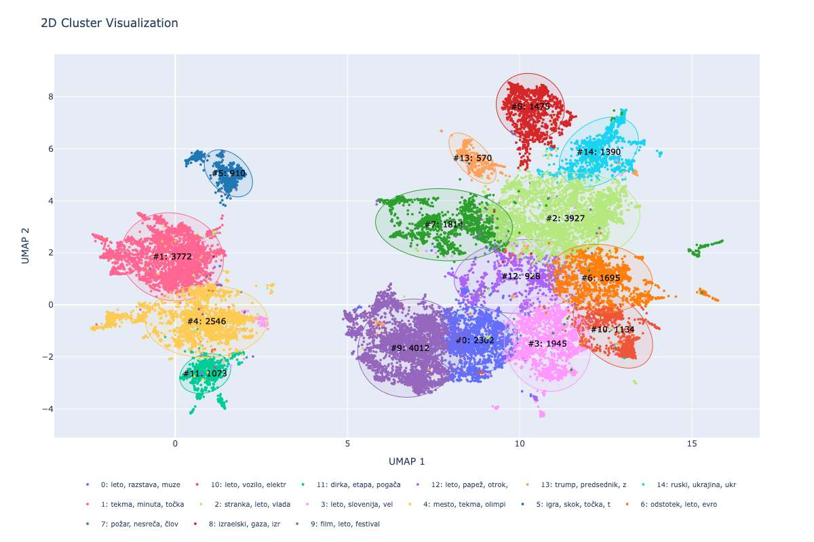
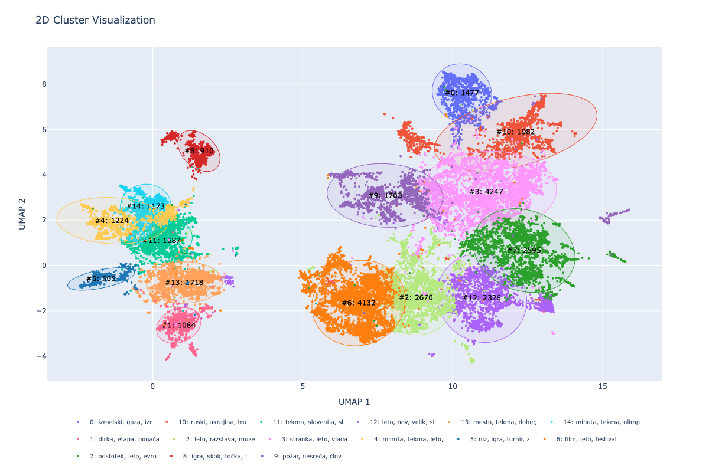
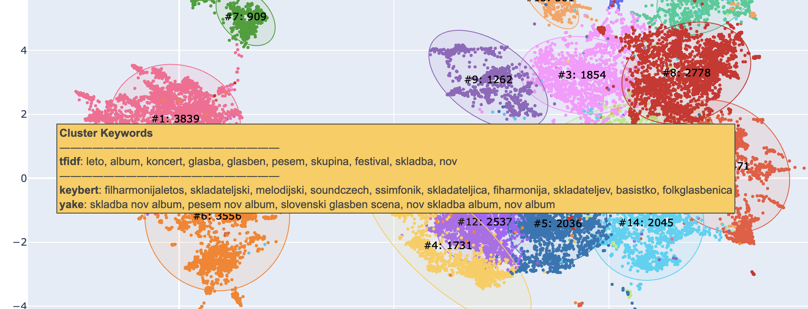
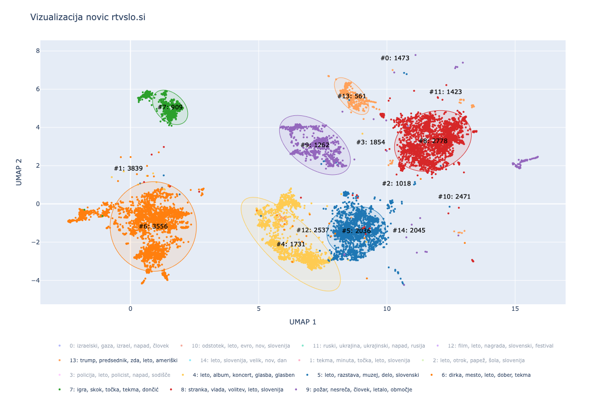

# Vizualizacija novic rtvslo.si
## Podani podatki
Novice so bile gručene na podlagi vsebine iz <b>naslovov</b>, <b>vodnikov (ang. lead)</b> in dejanskih <b>odstavkov</b> z vsebino. \
\
Na voljo so bili tudi podatki o temah, kot so te določene na spletni strani MMC. Natančnejše teme so bile izluščene iz URL-jev novic. <b>Teme iz MMC niso bile del gručenja</b>, za voljo evalvacije trenutnih tematskih sklopov pa so bile uporabljene za primerjavo. 

## Vložitev 
Za vložitev sta se izkazali za najbolj relavavantni dve metodi, ki sta si med seboj precej različni.\
\
<b>TF-IDF</b>\
TODO: check TF-IDF je metoda, ki uprablja frekvence na nivoju besed za oceno njihove pomembnosti v dokumentu. Izhod TF-IDF je 
redka matrika, ki ima lahko zelo veliko dimenzijo (št. atributov). Ker TF-IDF striktno ločuje različne oblike besed z istim korenom, je bila v ta namen vsebina člankov lematizirana.
<figure style="margin: 10px;">
  
  <figcaption>Gručenje s TF-IDF</figcaption>
</figure>

<b>SBERT</b>\
Za metodo vložitve SBERT člankov nismo lematizirali, saj deluje na principu konteksta, za kar so različne oblike besed zaželjene. SBERT besedila predstavi s precej manj-dimenzionalnim vektorejm kot TF-IDF. SBERT je sicer računsko zahtevnejši. \
\
V nadaljevalju je bil uporabljen SBERT:
- Boljša potencialna implementacija iskanja
- SBERT bolj odporen na tuje jezike
- Domnevno tukaj uspešen zaradi velikega korpusa (semantičnost na nivoju kljičnih besed)
- Za interpretabilnost lahko uporabimo TF-IDF

TO SAY(med seboj precej različni... nasprotni ... preverjen tudi različni berti kot je sloberta ampak se izkaže slabše)

### Zamnjševanje dimenzionalnosti
Za učinkovito gručenje moramo vložitve pretvoriti v vektorje z precej manj dimenzijami. Za TF-IDF je to jasno, zaradi velikanskih vložitev, vendar tudi pri SBERT z dobro pretvorbo na manj dimenzij lahko izluščimo pomembnejše atribute (dimenzije) in s tem zmanjšamo šum. \
Menogo clustering in drugih algoritmov uporablja razdalje med atributnimi zapisi podatkov. V velikih dimenzijah naletimo na "Curse of dimensionality", kar pomeni, da nam razdalje z večanjem dimenzij povejo čedalje manj.\
\
Zmanjševanje dimenzij je potekalo na dveh nivojih:
#### Zmanjševanje na dimenzionalnost primerno za gručenje
Za gručenje, smo dimenzionalnost vložitve zmanjšali na 25 dimenzij. 
Za ta postopek se je najbolje izkazal UMAP, predvsem za SBERT:
- ohranja lokalne stukture
- ohranja globalne strukture (delno)
- hiter (vendar počasnejši od pca ali svd)
- nelinearen

Za TF-IDF je bil dober kandidat tudi SVD. Deluje namreč dobro na "sparse" podatkih. SVD ali PCA se nista dobro izkazala na SBERT vložitvah najverjetneje zaradi nelinearnosti, TF-IDF matrike pa so BOW matrike in so linearno precej dobro ločljive (slika Gručenje s TF-IDF).

#### Zamnjševanje na 2 dimenziji za prikaz na podatkovni karti
Tu se kot pojavi še metoda t-SNE, ki je bila ustvarjena za ta namen. t-SNE je nelinearnma metoda, ki se izrazito osredotoča na lokalne strukture, med tem pa zmanjšuje "gužvo" na 2D/3D prikazu podatkov. Zaradi tega lahko ustvari popolnoma umeten prikaz razdalij med gručami, poleg tega pa za voljo gostih, lepih gruč lahko navrže naravno obliko le-teh. \
Zaradi tega ni smiselna izbira za zmanjševanje dimenzij pred gručenjem. \

<figure style="margin: 10px;">
  
  <figcaption>t-SNE oblike gruč</figcaption>
</figure>

Če zmanjšamo *perplexity* parameter, so lahko gruče sicer vseeno dovolj informativno postavljene (kot na sliki Gručenje z TF-IDF). t-SNE je lahko uporaben za strukture znotraj iste gruče, sicer pa so bili rezultati boljši z uporabo UMAP tudi za zmanjševanje na 2 dimenziji.
TO SAY kjer so med drugim vsaj delno ohranjene globalne strukture. \
\
t-SNE in UMAP sta za razliko od metod kot so SVD in PCA v osnovi nedeterministična.
## Gručenje 
TODO: Cluster explanations in explanations.txt for this example. Primer na prosojnice samo to

Za najboljši metodi gručenja sta se izkazali metodi DBSCAN in k-means. Obe metodi sta identificirali semantično zelo podobne gruče, je pa bila za končno rešitev izbrana metoda k-means na podlagi primerjave.

DBSCAN:
- potrebno dodatno klasificirati nerazvrščene (želja po vseh podatkih razvrščenih - vizualno)
- identificira 26 katerih večina je preprosta za interpretavijo. Nekatere pa so precej podobne in zahtevne za ločitev. 
- determinističen
- uporablja lokalno gostoto

k-means:
- hitrejši  
- možnost določitve števila gruč (vendar DBSCAN tu na začetku v veliko pomoč)
- nedeterminističen (lahko uporabno za odkrivanje znanj - na roke združit)
- določi globularno lepo oblikovane skupine 
TO SAY\
\
Razdalje:
- kosinusna boljša, vendar nekatere knjižnice ne podpirajo direktno. S pomočjo normalizacije lahko uporabimo evklidko razdaljo (sicer ni bistvene razlike)

<figure style="margin: 10px;">
  
  <figcaption>sbert dbscan</figcaption>
</figure>
<figure style="display: inline-block; margin: 10px;">
  
  <figcaption>sbert kmeans clustering 0</figcaption>
</figure>
<figure style="display: inline-block; margin: 10px;">
  
  <figcaption>sbert kmeans clustering 1</figcaption>
</figure>
<figure style="display: inline-block; margin: 10px;">
  
  <figcaption>sbert kmeans clustering 2</figcaption>
</figure>

Določitev števila skupin:

<figure style="margin: 10px;">
  
  <figcaption>sbert kmeans number of clusters</figcaption>
</figure>

Iz grafa smo predvsem glede na silhueto ugotovili, da ima lokalni maksimum pri 11 kategorijah. (če bi hoteli bili poravnani tudi s trenutnimi kategorijami pa bi izbrali 10 skupin (vpoštevajoč tudi silhueto)). Iz analize skupin iz DBSCAN, bi želeli nekje med 11 in 26 skupin. Za najlažjo interpretacijo in lepši prikaz se je izkazalo najbolje 15-16 skupin (kljub nižji silhueti).

### Evalvacija rezultatov metod
Metode smo evalvirali tudi na podlagi nekaterih numeričnih metod, vseeno pa so se izkazale za ključne pri izbiri <b>interpretabilnost</b> skupin in vizualno <b>jasen in smiselen prikaz</b> po uporabi metode v primerjavi. 
Interpretabilnost je bila izvedena na podlagi izluščenih ključnih besed skupin in desetih člankov, ki so bili semantično "najbolj" reprezentativni za skupino (kosinusna razdalja). \
Uporabljene numerične metrike:
- silhueta (na 25 dim.)
- Davies-Bouldin score TODO: kaj je to
- Poravnvnanost vložitve
- NPMI (koherentnost skupin na nivoju besed. Intra/inter cluster similarity)
    Uporabno za ektrakcijio besed (Gensim Coherence model)

- ARI, NMI TODO: kaj je to
\
Od vseh numeričnih metod je iz nenadzorovanega vidika še najbolj povedna silhueta TODO: why ni nujno. \
Za primerjavo dobljenih skupin s trenutno obstoječimi skupinami pa (<b>samo kot zanimivost!</b>) lahko uporabimo ARI, NMI Score.

| Metoda vložitve | Silhueta(25D) | Davies-Bouldin | ARI   | NMI   | Poravnanost vložitve | Povprečni NPMI |
| ---------------- | ------------- | -------------- | ----- | ----- | --------------------- | --------------- |
| SLOBERTA-DBSCAN  | 0.310         | 1.026          | 0.294 | 0.564 | 0.999                 | 0.091           |
| SBERT-DBSCAN     | 0.319         | 1.009          | 0.232 | 0.495 | 0.999                 | 0.087           |
| TFIDF-DBSCAN     | 0.325         | 1.019          | 0.178 | 0.424 | 0.999                 | 0.095           |
| SBERT-KMEANS     | 0.366         | 0.995          | 0.232 | 0.495 | 0.999                 | 0.090           |

TODO: move to README:
    koda za ta eval

### Razlaga skupin
TODO: label the saved clusters

Kot najboljša metoda je bila izbrana predstavitev skupin s pomočjo ključnih besed. 
a plus of TFIDF - getting this while using sbert
metode

✅ Example Use: Gensim’s CoherenceModel
You can do something like:

✅ Compared to TF-IDF
Feature	TF-IDF	PMI/NPMI
Focus	Individual word frequency	Word pairs and co-occurrence
Pros	Simple, fast	Captures topical coherence
Common artifacts	Words like “dejala”, “leto”, etc.	Fewer generic terms
Interpretability	Medium	High (shows word relationships)
Language dependent?	Somewhat	Less so — works on token co-occurrence
DO TU -------- basically poves da se isto obnasata, ker so semanticno kr tight te clustri in je jasno kere besede occurajo najbl
TODO: check ... ce sploh hoces govort o tem

D Stanza + Lemmatizaion
D To achieve explainability comparable to TF-IDF:
    Use SBERT embeddings to cluster semantically meaningful groups.
    Then apply TF-IDF or KeyBERT keyword extraction to each cluster independently, gaining TF-IDF-like interpretability at the end.

D On preprocessed tokens extract keywords

### SUMMARY

it was decided that the use interpret from given collection of keywords, since LLMs are not deterministi enough. On keywords
they hallucinate, on leads they overfixate on specifics.

## VIZUALIZACIJA

importance podat velikosti gruč. Tukaj bi lahko tudi združil katere grupe v postprocesiranju, vendar je currently avtomatsko
Ključne besede... podaj na hover top tfidf, top keybert ... each in its line
<figure style="margin: 10px;">
  
  <figcaption>sbert kmeans number of clusters</figcaption>
</figure>

Tukaj govoris potem o tem explainabilityju ... dejanskem importancu pokazat vse skupaj, da lahko uporabnik on the spot vidi in si predstavlja kaj je v tej gruči. NPMI se izkaze za zelo podobnega TFIDF zato ga v vizualizaciji ni

Moznost skrivanja posameznih skupin. Lažja analiza overlappinga.
<figure style="margin: 10px;">
  
  <figcaption>sbert kmeans number of clusters</figcaption>
</figure>

Alphashape konture niso najbolj smiselne. Zaradi robov, ki itak niso sharp:
    Zato elipse
    izracun elips, da je hover clean

Tukaj tudi pomemben pol noise kar je še en razlog zakaj sem se odločil za kmeans in umap, ker ga je blo še najmanj, pa da je vseeno vse semantično blizu in da se da na vizualizaciji gledat tudi relativno bližino (umap to respecta načeloma).

Potem lahko pogleda v dejanski izpis ... text file
