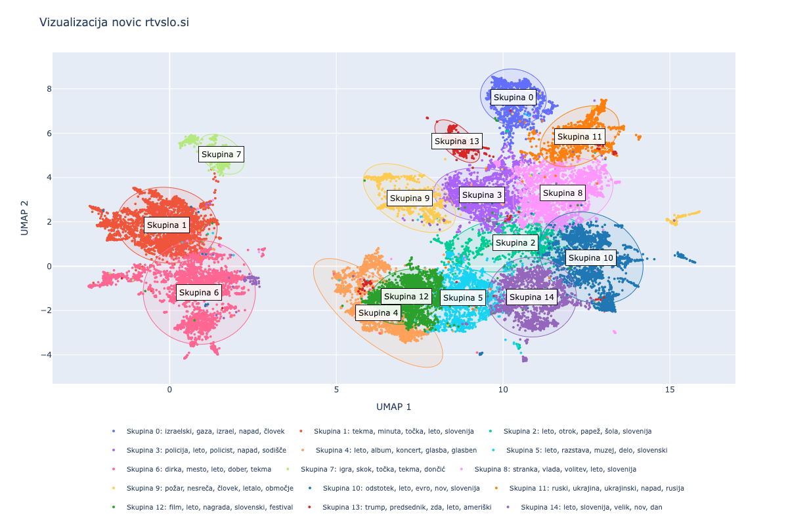

# Vizualizacija novic rtvslo.si
## Podani podatki
Novice so bile gručene na podlagi vsebine iz <b>naslovov</b>, <b>vodnikov (ang. lead)</b> in dejanskih <b>odstavkov</b> z vsebino. \
\
Na voljo so bili tudi podatki o temah, kot so te določene na spletni strani MMC. Natančnejše teme so bile izluščene iz URL-jev novic. <b>Teme iz MMC niso bile del gručenja</b>, za voljo evalvacije trenutnih tematskih sklopov pa so bile uporabljene za primerjavo. 

## Vložitev 
Za vložitev sta se izkazali za najbolj relavavantni dve metodi, ki sta si med seboj precej različni:\
\
<b>TF-IDF</b>\
TF-IDF je metoda, ki uprablja frekvence na nivoju besed za oceno njihove pomembnosti v dokumentu. Izhod TF-IDF je 
redka matrika, ki ima lahko zelo veliko dimenzijo (št. atributov). Ker TF-IDF striktno ločuje različne oblike besed z istim korenom, je bila v ta namen vsebina člankov lematizirana.
<figure style="margin: 10px;">
  
  <figcaption>Gručenje s TF-IDF</figcaption>
</figure>

<b>SBERT</b>\
Za metodo vložitve SBERT člankov nismo lematizirali, saj deluje na principu konteksta, za kar so različne oblike besed zaželjene. SBERT besedila predstavi s precej manj-dimenzionalnim vektorejm kot TF-IDF. SBERT je sicer računsko zahtevnejši. \
\
V nadaljevalju je bil uporabljen SBERT:
- Boljša potencialna implementacija iskanja
- SBERT bolj odporen na tuje jezike
- Domnevno tukaj uspešen zaradi velikega korpusa (semantičnost na nivoju kljičnih besed)
- Za interpretabilnost lahko uporabimo TF-IDF

### Zamnjševanje dimenzionalnosti
Za učinkovito gručenje moramo vložitve pretvoriti v vektorje z precej manj dimenzijami. Za TF-IDF je to jasno, zaradi velikanskih vložitev, vendar tudi pri SBERT z dobro pretvorbo na manj dimenzij lahko izluščimo pomembnejše atribute (dimenzije) in s tem zmanjšamo šum. \
Menogo clustering in drugih algoritmov uporablja razdalje med atributnimi zapisi podatkov. V velikih dimenzijah naletimo na "Curse of dimensionality", kar pomeni, da nam razdalje z večanjem dimenzij povejo čedalje manj.\
\
Zmanjševanje dimenzij je potekalo na dveh nivojih:
#### Zmanjševanje na dimenzionalnost primerno za gručenje
Za gručenje, smo dimenzionalnost vložitve zmanjšali na 25 dimenzij. 
Za ta postopek se je najbolje izkazal UMAP, predvsem za SBERT:
- ohranja lokalne stukture
- ohranja globalne strukture (delno)
- hiter (vendar počasnejši od pca ali svd)
- nelinearen

Za TF-IDF je bil dober kandidat tudi SVD. Deluje namreč dobro na "sparse" podatkih. SVD ali PCA se nista dobro izkazala na SBERT vložitvah najverjetneje zaradi nelinearnosti, TF-IDF matrike pa so BOW matrike in so linearno precej dobro ločljive (slika Gručenje s TF-IDF).

#### Zamnjševanje na 2 dimenziji za prikaz na podatkovni karti
Tu se kot pojavi še metoda t-SNE, ki je bila ustvarjena za ta namen. t-SNE je nelinearnma metoda, ki se izrazito osredotoča na lokalne strukture, med tem pa zmanjšuje "gužvo" na 2D/3D prikazu podatkov. Zaradi tega lahko ustvari popolnoma umeten prikaz razdalij med gručami, poleg tega pa za voljo gostih, lepih gruč lahko navrže naravno obliko le-teh. \
Zaradi tega ni smiselna izbira za zmanjševanje dimenzij pred gručenjem. \

<figure style="margin: 10px;">
  
  <figcaption>t-SNE oblike gruč</figcaption>
</figure>

Če zmanjšamo *perplexity* parameter, so lahko gruče sicer vseeno dovolj informativno postavljene (kot na sliki Gručenje z TF-IDF). t-SNE je lahko uporaben za strukture znotraj iste gruče, sicer pa so bili rezultati boljši z uporabo UMAP tudi za zmanjševanje na 2 dimenziji.
\
t-SNE in UMAP sta za razliko od metod kot so SVD in PCA v osnovi nedeterministična.
## Gručenje 
Za najboljši metodi gručenja sta se izkazali metodi DBSCAN in k-means. Obe metodi sta identificirali semantično zelo podobne gruče, je pa bila za končno rešitev izbrana metoda k-means na podlagi primerjave.

DBSCAN:
- potrebno dodatno klasificirati nerazvrščene (želja po vseh podatkih razvrščenih - vizualno)
- identificira 26 katerih večina je preprosta za interpretavijo. Nekatere pa so precej podobne in zahtevne za ločitev. 
- determinističen
- uporablja lokalno gostoto

k-means:
- hitrejši  
- možnost določitve števila gruč (vendar DBSCAN tu na začetku v veliko pomoč)
- nedeterminističen (lahko uporabno za odkrivanje znanj - na roke združit)
- določi globularno lepo oblikovane skupine 
\
Razdalje:
- kosinusna boljša, vendar nekatere knjižnice ne podpirajo direktno. S pomočjo normalizacije lahko uporabimo evklidko razdaljo (sicer ni bistvene razlike)

<figure style="margin: 10px;">
  
  <figcaption>DBSCAN</figcaption>
</figure>
<figure style="display: inline-block; margin: 10px;">
  
  <figcaption>k-means gručenje #1</figcaption>
</figure>
<figure style="display: inline-block; margin: 10px;">
  
  <figcaption>k-means gručenje #2</figcaption>
</figure>

Določitev števila skupin:

<figure style="margin: 10px;">
  
  <figcaption>Določanje števila skupin</figcaption>
</figure>

Iz grafa smo predvsem glede na silhueto ugotovili, da ima lokalni maksimum pri 11 kategorijah. (če bi hoteli bili poravnani tudi s trenutnimi kategorijami pa bi izbrali 10 skupin (vpoštevajoč tudi silhueto)). Iz analize skupin iz DBSCAN, bi želeli nekje med 11 in 26 skupin. Za najlažjo interpretacijo in lepši prikaz se je izkazalo najbolje 15-16 skupin (kljub nižji silhueti).

### Evalvacija rezultatov metod
Metode smo evalvirali tudi na podlagi nekaterih numeričnih metod, vseeno pa so se izkazale za ključne pri izbiri <b>interpretabilnost</b> skupin in vizualno <b>jasen in smiselen prikaz</b> po uporabi metode v primerjavi. 
Interpretabilnost je bila izvedena na podlagi izluščenih ključnih besed skupin in desetih člankov, ki so bili semantično "najbolj" reprezentativni za skupino (kosinusna razdalja). \
Uporabljene numerične metrike:
- silhueta (na 25 dim.)
- Davies-Bouldin index
- Poravnvnanost vložitve
- NPMI (koherentnost skupin na nivoju besed. Intra/inter cluster similarity)
    Uporabno za ektrakcijio besed (Gensim Coherence model)

- ARI, NMI
\
Od vseh numeričnih metod je iz nenadzorovanega vidika še najbolj povedna silhueta (SBERT vložitve niso nujno močno ločene) \
Za primerjavo dobljenih skupin s trenutno obstoječimi skupinami pa (<b>samo kot zanimivost!</b>) lahko uporabimo ARI, NMI Score.

| Metoda vložitve | Silhueta(25D) | Davies-Bouldin | ARI   | NMI   | Poravnanost vložitve | Povprečni NPMI |
| ---------------- | ------------- | -------------- | ----- | ----- | --------------------- | --------------- |
| SLOBERTA-DBSCAN  | 0.310         | 1.026          | 0.294 | 0.564 | 0.999                 | 0.091           |
| SBERT-DBSCAN     | 0.319         | 1.009          | 0.232 | 0.495 | 0.999                 | 0.087           |
| TFIDF-DBSCAN     | 0.325         | 1.019          | 0.178 | 0.424 | 0.999                 | 0.095           |
| SBERT-KMEANS     | 0.366         | 0.995          | 0.232 | 0.495 | 0.999                 | 0.090           |

### Razlaga skupin
Kot najboljša metoda je bila izbrana predstavitev skupin s pomočjo ključnih besed. \
Uporabljenih je bilo več metod za
pridobitev ključnih besed:
- TF-IDF na posameznih skupinah (na nivoju posameznih besede)
- NPMI (na nivoju parov besed)
- KeyBERT
- Yake

NPMI lahko nudi manj besed z malo informacije kot so 'velik', 'dejala', vendar je pri uporabi predprocesiranja
besedila izluščil praktično enake ključne besede kot TF-IDF, zato v končni vizualizaciji ni vključen. \
Besedilo je bilo lematizirano in predprocesirano s pomočjo Stanze, kjer s pomočjo POS-tagginga izluščimo samo glagole, pridevnike in prislove. \
\
Yake (Yet Another Keyword Extractor) je metoda, ki podobno kot TF-IDF deluje nad frekvenco besed, vendar je močnejši od TF-IDF. \
Model KeyBERT je osnovan na globoki nevronski mreži. \
\
Možen način za razlago skupin je tudi ekstrakcija osnutka s pomočjo velikih jezikovnih modelov, vendar se je ta izkazala za slabo, kjer te modele lahko poženemo kvečjemu nad ključnimi besedami, ali pa nekaj vodniki. V primeru ključnih besed so halucinacije prevelike za uporabo, pri uporabi vodnikov parih reprezentativnih člankov pa dobimo osnutek, ki se preveč osredotoča na izbrane vodnike. 
~~~
- Ukraine has to help Slovenia and Ukraine has to help Russia

- Divaa is a city in the southwestern part of the country .

- Dallas' coaches played the 45th series of finals in the league of basketball , and until now only two games were eliminated from 4:0 .

- In the car, we made the first mile with a new damage to the tire, which is technically similar to the superpower, so this time we looked a little more detailed about what the new one brings. It's gonna be a lot of years before electric vehicles are blown off the roads with internal combustion engines. At Volvo, only 100% of electric vehicles were thought to be manufactured. The executive director of Volva Jim Rowan was moved to change.

- electric cars are a big part of the electric car industry .
~~~
## VIZUALIZACIJA
V vizualizaciji so bile prikazane posamezne novice v obliki točk na podatkovni karti. Obarvane so glede na skupino, kateri pripadajo, kjer je na posamezno skupino položena elipsa, katere oblika je določena s pomočjo PCA nad točkami skupine in določeno odpornostjo na osamelce. \
Gruče so označene z indeksom skupine, ki je v legendi opisana z top 5 TF-IDF besed za preglednost in identifikacijo. \
Za natančnejši opis in določanja pomena skupine uporabnik lahko lebdi nad gručo, kjer se mu pokažejo ključne besede po več različnih metodah. 

<figure style="margin: 10px;">
  
  <figcaption>Izpis pri lebdenju nad skupino</figcaption>
</figure>

Uporabnik semantični pomen gruče izlušči na podlagi ključnih besed. Za več informacij se za vsako skupino lahko pogleda tudi najbolj reprezentativne novice (```explanations.txt```).\
\
Za vsako gručo je podana tudi njena velikost. \
\
Trenutna implementacija je avtomatska, vendar bi v denajski predstavitvi lahko združili katere od skupin ročno. Poleg tega bi se ročno lahko določilo osnutek skupine.
\
<figure style="margin: 10px; display: inline-block; ">
  
  <figcaption>Končna vizualizacija</figcaption>
</figure>

Uporabnik lahko v vizualizaciji upošteva tudi relativno oddaljenost in prekrivnost med skupinami, kjer lahko 
posamezne skupine tudi skriva.

<figure style="margin: 10px; display: inline-block; ">
  
  <figcaption>Skrivanje posameznih skupin</figcaption>
</figure>